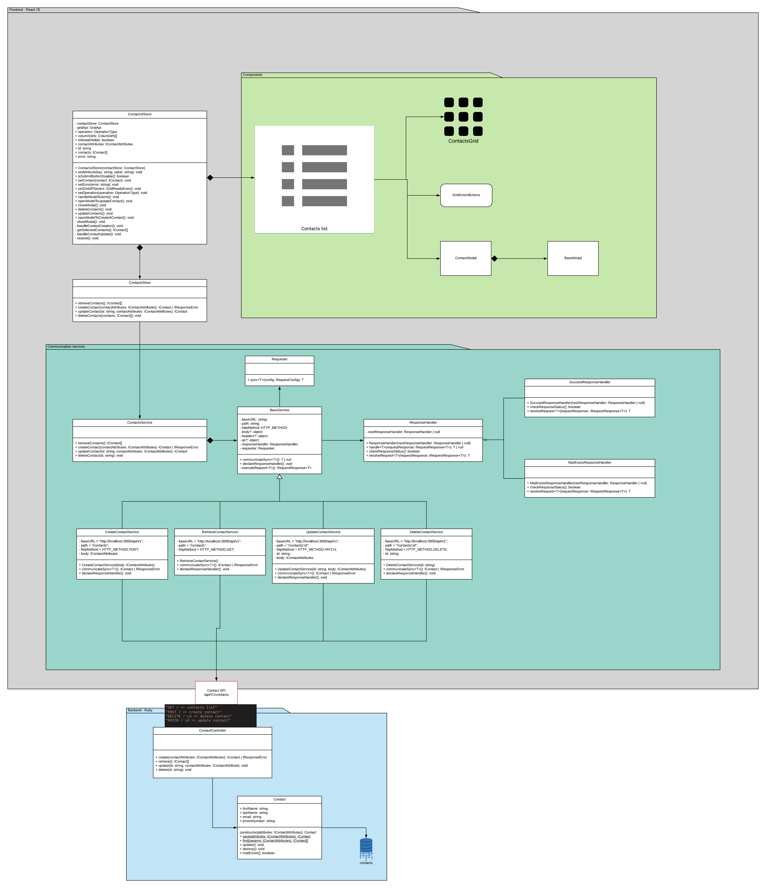

# CONTACTS CRUD

This project resolves the following statement:

```dotnetcli
We want a React + Backend application that allows you to create, read, update and delete a list of contacts. 
Each contact will have: First name, Last name, Email, and phone number.
All the fields are mandatory and there can’t be two contacts with the same email. 
The contacts will be persisted in the database.
```

## Tecnologies

As the statement says, the frontend must be donde with React JS. By cortesy of the developer, React uses Typescript. From the other hand, the backend is implemented using Ruby on Rails.


## Diagrams



## How to run the project

This how-to assumes that you have setup properly Ruby on Rails on your project. If not, follow the how-to from official web page: "[getting started with ruby on rails](https://guides.rubyonrails.org/getting_started.html)"

1. Install project dependencies

```dotnetcli
  $ bundle install --path vendor/bundle
  $ yarn
  $ rails db:migrate
  $ rails db:seed
  $ rails server
```

2. Open your browser and navigate to [entry point link](http://localhost:3000)